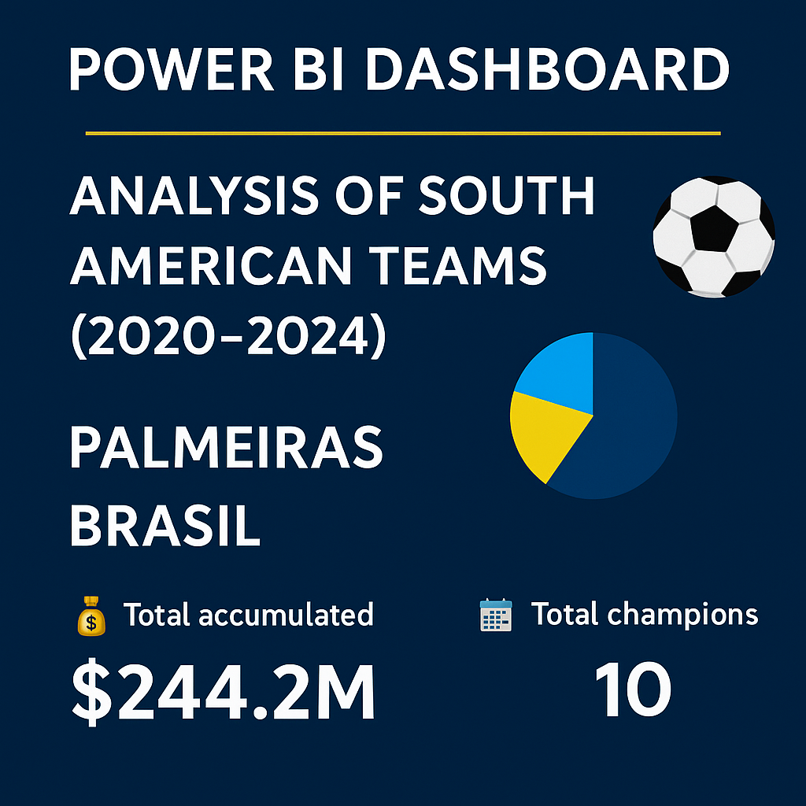

# ⚽ Power BI Dashboard – Análisis de Equipos Sudamericanos (2020–2024)

## 🇪🇸 Descripción en Español

Este proyecto consiste en la creación de un dashboard profesional en **Power BI** que analiza el rendimiento deportivo y financiero de los equipos sudamericanos participantes en la **Copa Libertadores** y **Copa Sudamericana** entre los años **2020 y 2024**.

### 🎯 Objetivos del Proyecto
- Visualizar qué países y equipos fueron campeones en cada torneo.
- Comparar ingresos financieros por participación y bonificaciones.
- Identificar los equipos con mejor desempeño financiero y deportivo.
- Brindar KPIs que resuman el impacto por temporada.

---

### 📊 Dashboards Incluidos

#### 1. Desempeño por País y Campeones
- Total de títulos por país y torneo.
- Evolución por temporada (2020–2024).
- KPIs:  
  🧑‍💼 Equipo más ganador  
  🌎 País dominante  
  🆕 Campeones únicos (una sola vez)

#### 2. Análisis Financiero
- Ingresos por participación y bonificaciones por equipo.
- Comparación visual de ingresos totales.
- KPIs:
  💰 Total de ingresos acumulados  
  📆 Promedio anual  
  🏆 Total de campeonatos ganados

---

### 🛠️ Tecnologías Utilizadas
- **Power BI** (DAX, visuales personalizados, segmentadores dinámicos)
- **SQL Server** (estructura de base de datos y limpieza de datos)
- Íconos/emojis para facilitar la lectura y hacer más amigable el análisis

---

### 🔄 Actualización futura
Después del nuevo formato del **Mundial de Clubes 2025**, este dashboard se actualizará para:
- Incluir a los equipos sudamericanos clasificados y sus ingresos adicionales.
- Comparar el impacto financiero pre y post Mundial.
- Analizar el rendimiento económico internacional.

📅 **Última actualización**: Junio 2024

💼 ¿Te interesa un dashboard como este para tus propios datos o tu organización?  
📩 Contáctame desde mi perfil para trabajar juntos 🚀

## 🇺🇸 English Version – South American Teams Dashboard (2020–2024)

This project presents a professional **Power BI dashboard** to analyze the sports performance and financial outcomes of South American football clubs in the **Copa Libertadores** and **Copa Sudamericana** from **2020 to 2024**.

### 🎯 Project Goals
- Track countries and teams that won each tournament.
- Compare financial income from participation and bonuses.
- Identify the most efficient and successful clubs.
- Deliver insightful KPIs that summarize the annual impact.

---

### 📊 Dashboards Included

#### 1. Country & Champion Analysis
- Total titles by country and competition.
- Year-over-year evolution (2020–2024).
- KPIs:  
  🧑‍💼 Most winning team  
  🌎 Top champion country  
  🆕 One-time champions

#### 2. Financial Performance
- Participation & bonus income by team and year.
- Bar chart for income comparison.
- KPIs:  
  💰 Total accumulated income  
  📆 Annual average  
  🏆 Total champions

---

### 🛠️ Technologies Used
- **Power BI** (DAX, dynamic slicers, custom visuals)
- **SQL Server** (data modeling and cleansing)
- Emojis and icons to enhance storytelling

---

### 🔄 Future Update
With the new **2025 FIFA Club World Cup** format, this dashboard will be updated to:
- Include qualified South American clubs and their earnings.
- Compare the financial impact before and after the tournament.
- Highlight global exposure performance.

📅 **Last update**: June 2024

💼 Interested in a dashboard like this for your data or your organization?  
📩 Contact me from my profile to work together 🚀

---

## 📁 Archivos incluidos
📊 Dashboard Sudamerica.pbix --> Archivo Power BI
🧠 Futbol_Conmebol.sql --> Script SQL de la base de datos
🖼️ portada.png --> Imagen de presentación del proyecto
📄 README.md --> Documentación bilingüe

